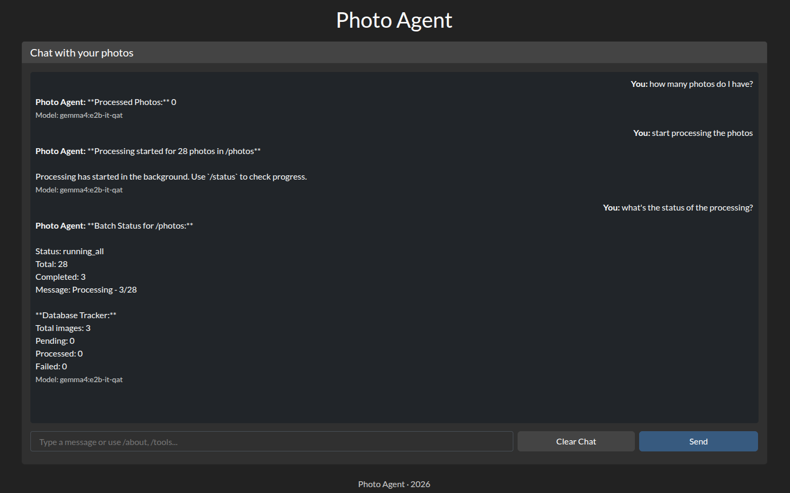
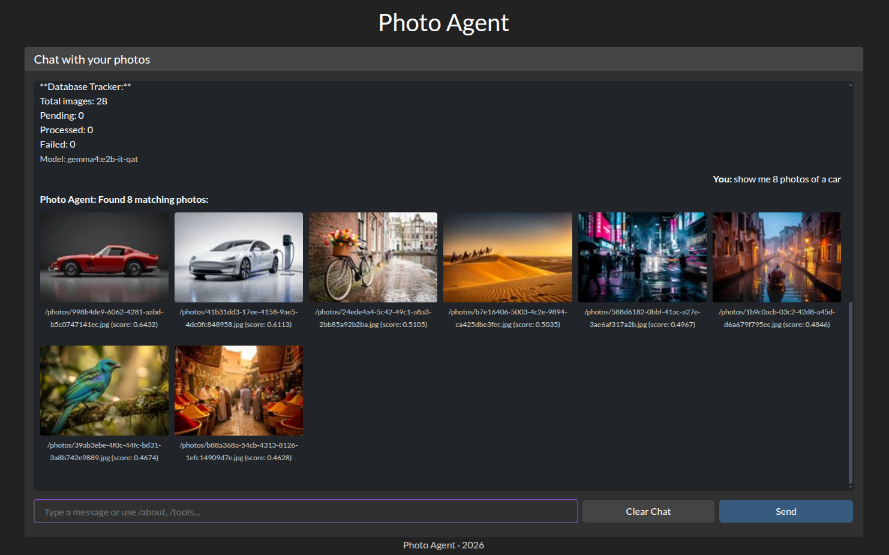
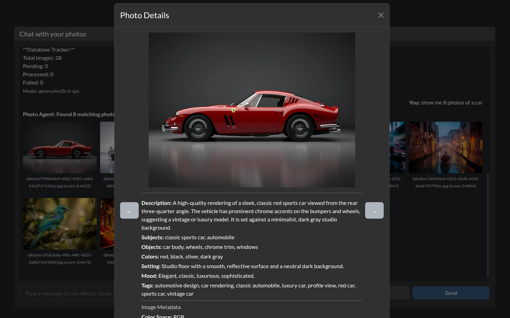

# Local Photo Agent

A lightweight Python application for extracting structured features, descriptions, and metadata from photos using Ollama vision models over a local network.

## Motivation

Both me and my family members had literally tens of thousands of photos of different things taken over a long time, all the photos are being stored on our family NAS and it's been very difficult to find something in those photos if, for example, the exact time when the photo was taken is not known. This application is my attempt to resolve this issue with a side quest of checking how Mistral.ai models work, as most of the initial code was created with Mistral Medium 3.5 which was later refactored with GLM-5.2. The application is designed to work with local LLM hosted on Ollama, and process photos stored on a local NAS. No data is leaving users home local network.

Users can process and look for photos in a few easy steps. After the application is started (see [Quick Start with Docker](#quick-start-with-docker)) we can start the photo processing by simply prompting the agent.


After the processing is done images can be searched using a simple "human" language like "find me photos from a renovation I've had last summer."


After photos are found they can be viewed in details or slideshow mode.


As this application was intended to be used by non-technical people the designing principle was that the agent cannot modify photo files in any way. It only writes descriptions, embeddings and metadata into its own local folder that's being stored together with photos, ensuring data locality. The application is intended to be run on a local network, so it does not have any substantial security features, though they may be added in the future releases.

## Features

- Connect to an Ollama instance via configurable host/port
- Extract structured features from single or multiple images
- **Process entire folders (recursive or flat) from the CLI**
- **Process server-side folders via chat commands** in the web UI (`/process`, `/scan`)
- Support for custom prompts and model options
- Automatic JSON parsing of model responses
- Batch processing with progress logging and resume support
- **Simple database-based tracking** — replaces complex WAL system with straightforward SQLite tracking
- Health check to verify Ollama availability
- **Metadata extraction** — automatic EXIF, IPTC, and XMP metadata extraction from images
- **Visual thumbnail previews** in the web UI — chat results render as clickable image thumbnails; click any thumbnail to open a detail modal with a larger preview and extracted metadata.
- **Fullscreen photo viewer** — from the detail modal, open a full-viewport viewer with navigation arrows, keyboard controls, and a toggleable metadata overlay for high-resolution browsing.
- **Web-based UI via Dash** centered on a chat interface
- **Full-text search (FTS5)** over extracted descriptions, subjects, tags, and more, driven from the chat interface
- **Vector embedding support** — generate vector embeddings for images using Ollama's `/api/embeddings` endpoint and find visually similar photos using cosine similarity with sqlite-vec
- **Find Similar** — click "Find Similar" in the detail modal or fullscreen viewer to discover visually similar images in your collection
- **Chat with Ollama** — interact directly with your Ollama LLM via the web UI chat; use `/about`, `/tools`, `/find`, `/count`, `/scan`, `/process`, `/status` to drive the agent
- **Chat API** — REST endpoint at `POST /_api/chat` for programmatic access to the LLM

## Prerequisites

- [Docker](https://www.docker.com/) and Docker Compose installed (optional)
- A running Ollama server (local or on the network)
- A vision-capable model pulled in Ollama (e.g., `gemma4:e2b-it-qat`)

### Vector Embedding Requirements (Optional)

**Vector search and similarity features have two modes:**

#### Mode 1: sqlite-vec (Recommended for Production)

For best performance with large datasets, use sqlite-vec:

1. **sqlite-vec (RECOMMENDED)** — SQLite extension for fast vector search
   ```bash
   pip install sqlite-vec
   ```

2. **Ollama v0.1.0+** — For the `/api/embeddings` endpoint
   ```bash
   ollama --version  # Check your version
   # Upgrade if needed by following Ollama's upgrade instructions
   ```

3. **Embedding model** — Pull an embedding-capable model:
   ```bash
   ollama pull nomic-embed-text  # Default, 768 dimensions
   # or
   ollama pull all-minilm       # 384 dimensions
   ```

#### Mode 2: REST-based Vector Search (Fallback - No sqlite-vec Required)

If sqlite-vec cannot be installed (e.g., in Docker containers without extension loading support), the application automatically falls back to REST-based vector search:

- **No sqlite-vec required** — Uses Python-based cosine similarity calculations
- **Works in Docker** — Tested in the local-photo-agent container
- **Slower for large datasets** — Loads all embeddings into memory for comparison
- **Same functionality** — All vector search features work identically

**REST API Endpoint:**
```
POST /_api/find_similar
{
    "folder": "/path/to/folder",
    "query": "text description",  // OR
    "vector": [0.123, 0.456, ...],  // OR
    "image_path": "/path/to/image.jpg",
    "model_name": "nomic-embed-text",
    "limit": 10
}
```

**Test Endpoint:**
```
GET /_api/test_rest_vector_search
```

This returns a status report confirming REST vector search is working.

Or use alternative embedding models:
```bash
ollama pull clip-vit-base-patch32  # 512 dimensions
```

## Quick Start with Docker

Run the one-command setup script:

```bash
# Start the app without mounting a folder
./setup.sh

# Start the app and mount a host folder into /photos in the container
./setup.sh /path/to/your/photos

# Set the LLM (Ollama) host IP and persist it to the folder's settings
./setup.sh --host 192.168.1.5 /path/to/your/photos
```

Then open [http://localhost:8050](http://localhost:8050).

**Tip:** When you pass a folder to `setup.sh`, it automatically creates a temporary `docker-compose.override.yml` that mounts your folder into the container as `/photos`. You can then point the agent at `/photos` (via the `LOCAL_PHOTO_AGENT_FOLDER` setting or a chat `/scan /photos` command) to process that folder.

**`--host` and per-folder settings:** `--host <ip>` writes the LLM host into `<folder>/.local-photo-agent/settings.json` (the same per-folder settings file the Settings modal uses). The app reads this file on start, so the saved host overrides `LOCAL_PHOTO_AGENT_LLM_HOST` from the environment. `--host` requires a mounted folder (the settings file lives inside it). Use `./setup-arm.sh` the same way on ARM64.

### Manual Docker commands

```bash
# Build and start the container
docker compose up -d --build

# View logs
docker compose logs -f

# Stop the container
docker compose down
```

**Note:** Update `LOCAL_PHOTO_AGENT_LLM_HOST` in your `.env` file or `docker-compose.yml` if your Ollama server is on a different IP.

### Mounting a folder for processing inside Docker

If you want to process photos that live on the host via the web UI chat, mount them into the container:

```yaml
volumes:
  - /path/on/host:/photos
```

Then point the agent at `/photos` (via `LOCAL_PHOTO_AGENT_FOLDER` or a chat `/scan /photos` command).

## Command-Line Usage

The `main.py` script accepts individual files **or folders**.

```bash
# Show the installed version
python main.py --version

# Process a single image
python main.py photo.jpg

# Process multiple images
python main.py photo1.jpg photo2.png

# Process an entire folder (recursive by default)
python main.py ./my-vacation-photos

# Process a folder without recursion
python main.py ./my-vacation-photos --no-recursive

# Save results to a JSON file
python main.py ./photos --output results.json

# Resume a previously interrupted batch (skip already-processed images)
python main.py ./photos --resume

# Force reprocess all images, ignoring previous progress
python main.py ./photos --no-resume

# Process images in parallel (batch) against Ollama
# Requires Ollama to be configured for concurrent requests
# (e.g. OLLAMA_NUM_PARALLEL=4). Default is 1 (sequential).
python main.py ./photos --concurrency 4

# Vector embedding options
# Generate embeddings (enabled by default)
python main.py ./photos

# Disable embedding generation
python main.py ./photos --no-embeddings

# Use a specific embedding model
python main.py ./photos --embedding-model all-minilm

# Only generate embeddings (skip LLM extraction)
python main.py ./photos --embeddings-only

# Find similar images to a specific photo
python main.py ./photos/photo1.jpg --find-similar --similar-limit 5

# List available embedding models from Ollama
# (a path argument is required; "." is a harmless placeholder)
python main.py . --list-embedding-models

# Generate embeddings for existing photos (without reprocessing)
python main.py ./photos --embeddings-only
```

Supported image extensions: `.jpg`, `.jpeg`, `.png`, `.webp`, `.gif`, `.bmp`, `.tiff`, `.tif`, `.heic`, `.heif`

### SQLite Database Storage

Whenever the app processes an image inside a folder, the result is stored in a local SQLite `features.db`.

```
my-photos/
├── vacation.jpg
└── .local-photo-agent/
    ├── batch_state.json       # Web UI batch progress summary
    └── features.db            # SQLite database (raw + normalised data + tracking)
```

The `features.db` SQLite database includes:
- `raw_features` — the full JSON result for every processed image.
- `extracted_features` — normalised columns (`description`, `subjects`, `objects`, `colors`, `setting`, `mood`, `tags`) for fast querying.
- `feature_tags` — one row per tag per image, enabling tag counts and filtering.
- `extracted_features_fts` — FTS5 full-text index (external content) for searching descriptions and tags.
- `image_embeddings` — metadata table for vector embeddings (image_path, model_name, embedding_dimension, created_at)
- `vec_embeddings` — sqlite-vec virtual table for fast vector similarity search (requires sqlite-vec)
- `processing_tracker` — simple tracking table replacing the WAL system (image_path, status, processed_at, error_code, error_msg)
- `image_metadata` — EXIF, IPTC, and XMP metadata extracted from images

**Note:** Vector embeddings are stored in SQLite for efficiency.

## Web UI Usage

Open [http://localhost:8050](http://localhost:8050) after starting the app.

1. **Settings**: Enter the LLM host, port, and model.
2. **Chat**: The main UI is a chat interface with your Ollama LLM. Drive the agent with slash commands:
   - `/scan` — list processable images in the current folder
   - `/process` — process pending images in the current folder
   - `/find <query>` — full-text search over descriptions, subjects, and tags
     - Append `@<date>` to restrict results by when the photo was taken, e.g.
       `/find car @last summer`, `/find 5 dogs @summer 2024`,
       `/find snow @january 2024`, or `/find beach @2023`. Recognised date
       expressions include relative terms (`last summer`, `this month`,
       `last week`, `yesterday`), seasons with a year (`summer 2024`,
       `winter 2024`), month/year (`january 2024`), and bare years (`2023`).
       Open-ended expressions (e.g. `around Christmas a few years ago`) are
       resolved by the LLM, which classifies each expression and routes
       standard forms to a deterministic parser and fuzzy forms to itself.
       You don't have to use `@` — the find tool asks the LLM to split the
       visual description from the time reference, so `find me photos from
       last winter with a baby on them` works directly (the LLM separates
       "baby" from "last winter" before searching).
   - `/count` — count processed/unprocessed images
   - `/status` — show batch processing status
   - `/tags` — list extracted tags
   - `/tag <name>` — show photos with a specific tag
   - `/about`, `/tools` — agent info and available tools

   **Live progress bar:** When you run `/process` or `/status`, a real-time progress bar appears above the chat input. It polls the batch state every ~1.5s, shows processed/total and a percentage, and hides itself a few seconds after the batch completes or is aborted.

   **Database storage:** When a folder is processed, results are stored in a SQLite `features.db` database inside `.local-photo-agent/` in the same folder.
3. **SQL Explorer**: Run raw SQL queries against the per-folder `features.db` SQLite database for advanced exploration.
4. **Metadata Tester**: Test metadata extraction from uploaded images to verify EXIF, IPTC, and XMP data extraction.

### Vector Embedding Features in Web UI

- **Find Similar** — In the photo detail modal, click "Find Similar" to display a carousel of visually similar images with similarity scores
- **Fullscreen Similar** — In the fullscreen viewer, click "Find Similar" to find and navigate through similar photos
- **Embedding Status** — The detail modal shows whether an embedding is available for the current image
- **Performance** — Similarity search typically completes in <500ms for collections of 10,000+ images (using sqlite-vec)

> **Preview & Detail Modal:** Click any thumbnail returned by the chat to open a modal with a larger image preview and the extracted metadata (description, subjects, objects, colors, setting, mood, tags). If an image has not been processed yet, the modal shows a "Not yet processed" placeholder.
>
> **Fullscreen Viewer:** From the detail modal, click the **Fullscreen** button to open a full-viewport photo browser with a black background. Use the left/right arrow buttons (or keyboard arrow keys) to navigate through the album. A **Toggle Info** button shows or hides a semi-transparent overlay with the extracted description, subjects, and tags. You can also press **`i`** on the keyboard to toggle the overlay when the fullscreen viewer is open.

## REST API Endpoints

The web application (`app.py`) provides several REST API endpoints for programmatic access:

| Method | Endpoint | Description |
|--------|----------|-------------|
| GET | `/preview?path=<path>&size=<size>` | Get a resized image thumbnail (supports HEIC/HEIF conversion) |
| POST | `/_api/chat` | Send a chat message to Ollama and get a response |
| POST | `/_api/chat/stream` | Stream a chat response from Ollama as Server-Sent Events |
| GET | `/_api/process_status?folder=<folder>` | Live batch processing progress (status, total, completed) for the chat progress bar |
| POST | `/_api/find_similar` | Find similar images using vector embeddings |
| GET | `/_api/test_rest_vector_search` | Test REST-based vector search functionality |
| GET | `/_api/test_store_vector` | Test storing a vector in the database |
| GET | `/_api/test_vector_roundtrip` | Test vector storage and retrieval |
| POST | `/_api/store_vector` | Store a vector embedding in the database |
| GET | `/_api/get_vector` | Retrieve a vector embedding from the database |
| POST | `/_api/reveal` | Return the filesystem path of a photo (for copy/display) |

### Chat API Example

The `/_api/chat` endpoint accepts a JSON payload with the following fields:

| Field | Required | Description |
|-------|----------|-------------|
| `message` | yes | The chat message to send |
| `host` | no | LLM server host (defaults to config `LOCAL_PHOTO_AGENT_LLM_HOST`) |
| `port` | no | LLM server port (defaults to config `LOCAL_PHOTO_AGENT_LLM_PORT`) |
| `model` | no | LLM model tag (defaults to config `LOCAL_PHOTO_AGENT_LLM_MODEL`) |
| `folder` | no | Folder path for chat tools that query a processed database |
| `history` | no | Prior conversation history as a list of messages |

```bash
curl -X POST http://localhost:8050/_api/chat \
  -H "Content-Type: application/json" \
  -d '{"message": "Describe this photo", "folder": "/photos", "history": []}'
```

Response:

```json
{
  "status": "success",
  "response": "This is a beautiful landscape photo with...",
  "sender": "assistant",
  "model": "gemma4:e2b-it-qat"
}
```

When the chat service returns a typed response (e.g., photo results), the response includes an additional `response_type` field (e.g., `"photos"`).

### Find Similar API Example

```bash
curl -X POST http://localhost:8050/_api/find_similar \
  -H "Content-Type: application/json" \
  -d '{"folder": "/path/to/photos", "image_path": "/path/to/query.jpg", "limit": 5}'
```

### Copy Path API Example

The `/_api/reveal` endpoint returns the filesystem path of a photo so you can locate it. The path must resolve to a real file inside `folder` (directory-traversal attempts are rejected with 404).

```bash
curl -X POST http://localhost:8050/_api/reveal \
  -H "Content-Type: application/json" \
  -d '{"folder": "/path/to/photos", "path": "/path/to/photos/vacation.jpg"}'
```

Response:

```json
{
  "status": "success",
  "path": "/path/to/photos/vacation.jpg",
  "folder": "/path/to/photos"
}
```

In the web UI, click **Copy Path** in the detail modal or the fullscreen viewer. The photo's full path is shown in a toast and copied to your clipboard. The path is the server-side path (where the app reads the file); when the app runs on a remote machine, that is the path on that machine.

#### Path mapping (`LOCAL_PHOTO_AGENT_REVEAL_MAP`)

When the server-side path differs from the path you want to see (e.g. a Docker bind mount exposes host `/home/user/Pictures` as `/photos` inside the container), set `LOCAL_PHOTO_AGENT_REVEAL_MAP` to a newline- or semicolon-separated list of `container_prefix=host_prefix` entries. The first matching prefix is replaced before the path is returned:

```
LOCAL_PHOTO_AGENT_REVEAL_MAP=/photos=/home/user/Pictures
```

Multiple entries:

```
LOCAL_PHOTO_AGENT_REVEAL_MAP=/photos=/home/user/Pictures;/data=/mnt/data
```

When unset (the default), the app auto-detects the mapping by reading `/proc/self/mountinfo` inside the container (no manual config needed for Docker bind mounts). On the host (no container), the server-side path is returned as-is.

## Usage as a Library

If you want to use the extractor in your own Python scripts (outside Docker):

```bash
pip install -r requirements.txt
```

```python
from plugins.llm import create_extractor
from src.utils import encode_image_file

extractor = create_extractor(
    host="127.0.0.1",
    port=11434,
    model="gemma4:e2b-it-qat",
)

# Read the image and extract features via base64.
b64 = encode_image_file("photo.jpg")
result = extractor.extract_b64(b64)
print(result.as_dict())
```

### Batch processing from code

```python
from plugins.llm import create_extractor
from src.config import ProcessingConfig
from src.sequential_processor import process_paths

extractor = create_extractor(host="127.0.0.1", port=11434, model="gemma4:e2b-it-qat")
config = ProcessingConfig.from_env()  # Or specify individual parameters

# Process multiple images sequentially
results = process_paths(["photo1.jpg", "photo2.jpg"], extractor, prompt="Describe this photo", resume=False)

for result in results["results"]:
    print(result.get("image_path"), result.get("success"))
```

You can also discover and process a whole folder:

```python
from src.discovery import PhotoList
from src.sequential_processor import process_paths

# Discover all images in a folder
photo_list = PhotoList(recursive=True)
image_paths = photo_list.list_photos(["./my-photos"])

# Process all discovered images
results = process_paths(image_paths, extractor, resume=True)
print(f"Processed {results['processed']} images, {results['successes']} succeeded")
```

## Supported Image Formats

Any format your local environment can read (commonly `.jpg`, `.jpeg`, `.png`, `.webp`, `.gif`, `.bmp`, `.tiff`, `.tif`), plus **HEIC / HEIF** (Apple iPhone photos) through on-the-fly JPEG conversion for both processing and web previews.

### HEIC / HEIF support

Processing `.heic`/`.heif` files requires two extra Python packages:

```bash
pip install pillow pillow-heif
```

They are already listed in `requirements.txt`, so installing from there is enough.

When a HEIC image is processed or previewed in the web UI, it is automatically converted to a high-quality JPEG **in memory** before being sent to Ollama or the browser. No originals are modified.

## Notes

- The default prompt asks the model to return JSON. Not all models will strictly obey; check `result["parsed"]`.
- You can override the default prompt with any custom text via the `--prompt` CLI argument, the web UI text area, or the `prompt` parameter in code.
- When processing large folders, consider potential memory usage from base64 encoding many images at once.
- The application now uses a **simplified processing tracker** (`SimpleProcessingTracker`) that stores tracking information directly in the SQLite database instead of using WAL files.
- **Automatic resume**: By default, the CLI will skip already-processed images on consecutive runs (use `--no-resume` to force reprocessing).
- **Parallel batch processing**: Set `--concurrency N` (CLI) or `LOCAL_PHOTO_AGENT_BATCH_CONCURRENCY=N` (env) to process up to `N` images in parallel against the LLM backend. The default `1` preserves the historical sequential behaviour. Database writes are serialized internally, so only the LLM/embedding network calls run concurrently. This requires the backend to accept concurrent requests — for Ollama, set `OLLAMA_NUM_PARALLEL` (and ensure enough model slots/contexts) or requests will simply queue server-side with no speedup. In the web UI, adjust **Settings → Connection → Batch concurrency** to change the value used by `/process` without restarting the app.
- **Per-folder settings**: The batch concurrency value is persisted per folder in `<folder>/.local-photo-agent/settings.json` and read at processing start, so each folder can have its own parallelism. When you change **Settings → Connection → Batch concurrency** in the web UI, it is written to the active folder's settings file. On processing start (CLI or `/process`), the per-folder file overrides the env/CLI default when present; otherwise the env/CLI default applies.
- **Persisted connection settings**: The same per-folder `settings.json` also stores the LLM host/port/model/backend, timeout, recursive/dry-run flags, and embedding options when you change them in the **Settings** modal. On app start, stored values override the environment defaults, so the Settings form and the chat/processing clients pick up the saved values. `setup.sh --host <ip>` (and `setup-arm.sh --host <ip>`) pre-fills the LLM host into this file at build time; all other settings are only written when you change them in the UI.

## Key Design Principles

- **Dependency injection** — Services and extractors are passed to components that need them
- **Pluggable backends** — Add new LLM providers or embedding generators via the plugin system
- **Progressive enhancement** — Works without sqlite-vec (with fallback), without embeddings, without metadata
- **Backward compatibility** — SQLite database structure supports existing data
- **Separation of concerns** — CLI, Web UI, and core processing logic are cleanly separated
- **Clean architecture** — Centralized constants, configuration dataclasses, and well-defined interfaces
- **Pluggable architecture** — LLM backends (`plugins/llm/`) and image format handlers (`plugins/formats/`) can be added via plugins
